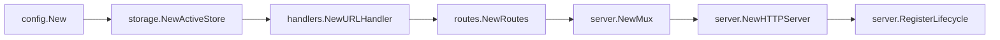
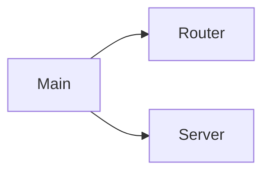
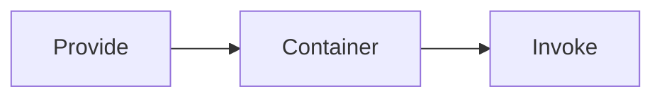
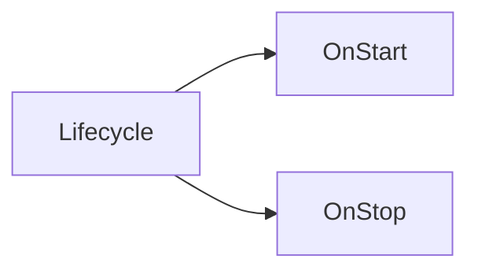
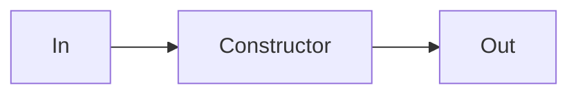
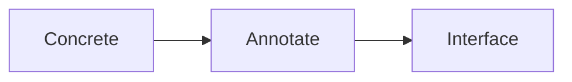
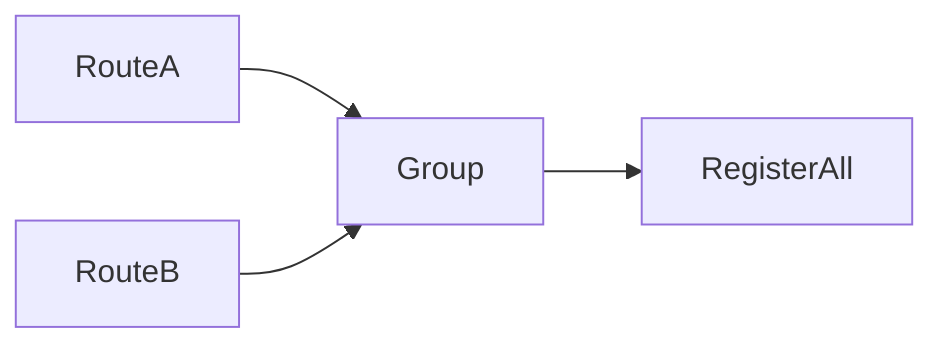
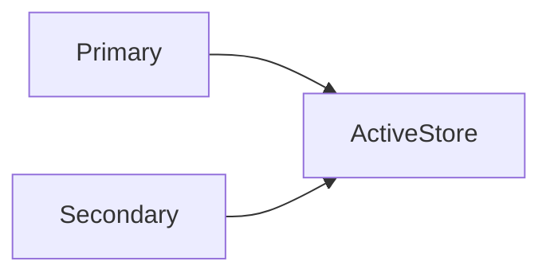
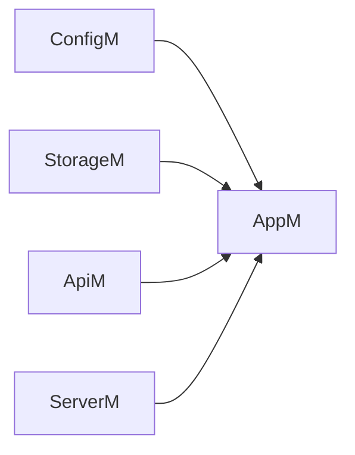
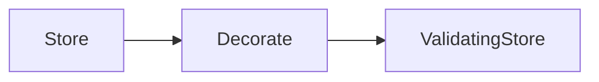

# Visual Walkthrough: Minimal Fx URL Shortener

This project is intentionally small and organized around teaching dependency injection with Uber Fx.

## Dependency flow (final app)



## Step checkpoints

Each folder below compiles and runs independently:

- `checkpoints/01-manual-wiring`
- `checkpoints/02-provide-invoke`
- `checkpoints/03-lifecycle`
- `checkpoints/04-in-out`
- `checkpoints/05-annotate-as`
- `checkpoints/06-value-groups`
- `checkpoints/07-named-values`
- `checkpoints/08-module`
- `checkpoints/09-decorate`

Run any step:

```bash
go run ./checkpoints/02-provide-invoke
```

## Wiring evolution

### 01 → manual baseline
Before: constructors and route wiring done directly in `main.go`.
After: still manual, but now ready for extraction.



### 02 → `fx.Provide`/`fx.Invoke`
Before: manual object passing.
After: container constructs dependencies and invokes entry points.



### 03 → `fx.Lifecycle`
Before: server start/stop was unmanaged.
After: startup and graceful shutdown are lifecycle hooks.



### 04 → `fx.In`/`fx.Out`
Before: long constructor argument lists.
After: explicit dependency bundles and structured outputs.



### 05 → `fx.Annotate`/`fx.As`
Before: concrete types tied to providers.
After: providers exported as interfaces for cleaner boundaries.



### 06 → value groups (`group:"routes"`)
Before: routes registered one by one.
After: route providers contribute into one grouped collection.



### 07 → named values
Before: single store instance.
After: `primary` and `secondary` stores demonstrate named dependency wiring.



### 08 → `fx.Module`
Before: global option list.
After: features grouped into `config`, `storage`, `handlers`, `routes`, `server`, `app`.



### 09 → `fx.Decorate`
Before: store returned directly.
After: store decorated with URL validation behavior without changing constructors.



## Verify the final app

```bash
go run ./cmd/shortener
```

```bash
curl -s -X POST http://localhost:8080/shorten \
  -H 'Content-Type: application/json' \
  -d '{"url":"https://go.dev"}'
```

Then open returned `short_url` or run:

```bash
curl -i http://localhost:8080/u1
```

## Common Fx errors (quick guide)

- **missing type in container**: ensure provider is included in a module.
- **duplicate providers**: keep one constructor per same unnamed type unless using names.
- **failed invoke**: check constructor errors and input tags (`name`, `group`).
- **lifecycle hangs**: confirm `OnStop` shuts down long-running goroutines/servers.

## Which pattern to use when

- `fx.Provide` + `fx.Invoke`: basic composition and startup entry points.
- `fx.In`/`fx.Out`: constructor signatures become explicit and scalable.
- `fx.Annotate`/`fx.As`: expose interfaces cleanly.
- `name:"..."`: multiple instances of the same type.
- `group:"..."`: plugin-like collections (routes, hooks, jobs).
- `fx.Module`: feature-level organization.
- `fx.Decorate`: wrap behavior cross-cuttingly without touching original constructors.

## Slide-to-code index

- Slide 1 (manual baseline): `checkpoints/01-manual-wiring/main.go`
- Slide 2 (`Provide`/`Invoke`): `checkpoints/02-provide-invoke/main.go`
- Slide 3 (`Lifecycle`): `internal/server/server.go`
- Slide 4 (`In`/`Out`): `internal/api/handlers/handlers.go`, `internal/api/routes/routes.go`
- Slide 5 (`Annotate`/`As`): `internal/storage/storage.go`
- Slide 6 (value groups): `internal/api/routes/routes.go`
- Slide 7 (named values): `internal/storage/storage.go`
- Slide 8 (`Module`): `internal/app/app.go`
- Slide 9 (`Decorate`): `internal/storage/storage.go`, `internal/app/app.go`
