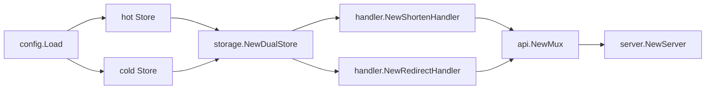
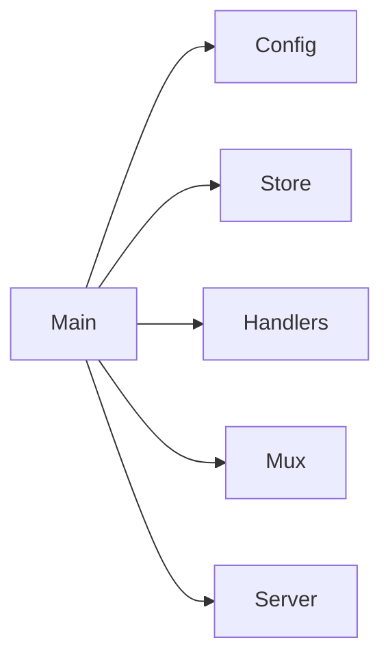
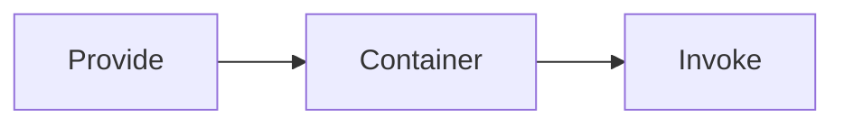
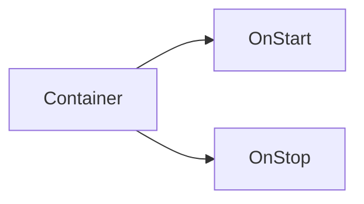
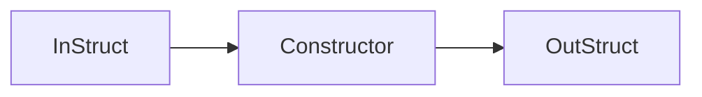
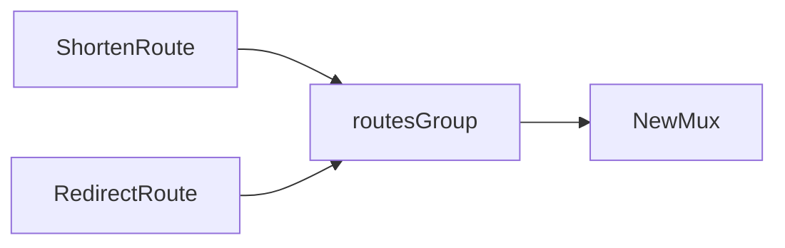
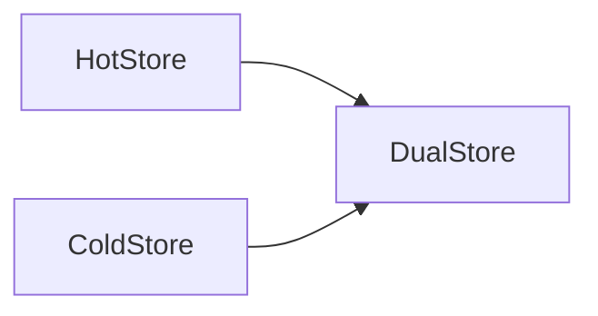
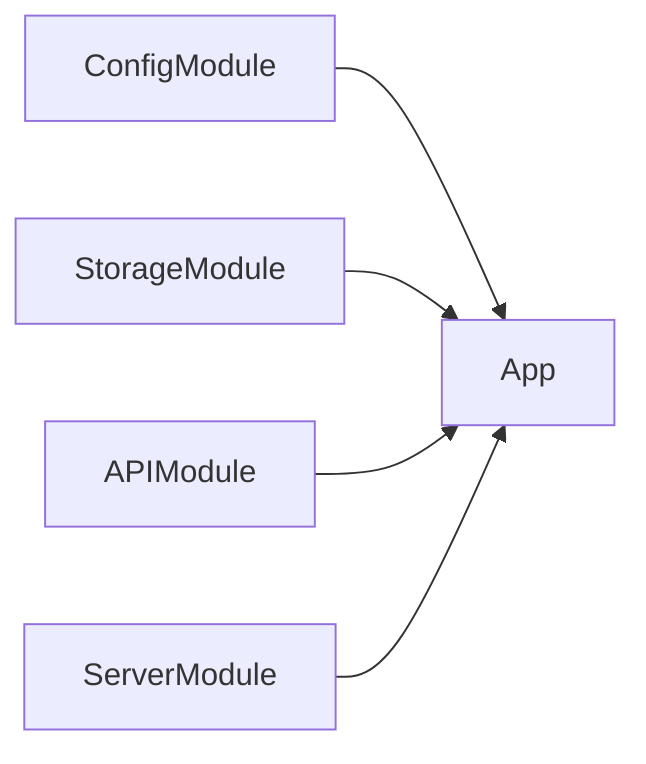
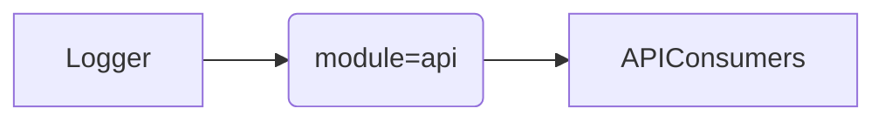
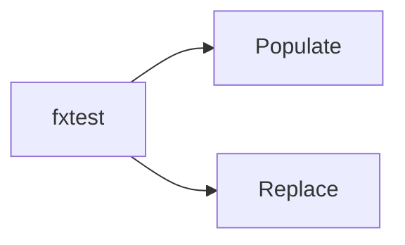

# Visual Walkthrough: URL Shortener Fx Steps

## Final dependency graph

## Step map (branch narrative mirrored as folders)

- `step-00-manual` → baseline manual wiring
- `step-01-provide-invoke` → `fx.Provide`, `fx.Invoke`
- `step-02-lifecycle` → `fx.Lifecycle`
- `step-03-in-out` → `fx.In`, `fx.Out`
- `step-04-annotate-as` → `fx.Annotate`, `fx.As`
- `step-05-value-groups` → `group:"routes"`
- `step-06-named-values` → `name:"hot"`, `name:"cold"`
- `step-07-module` → `fx.Module`
- `step-08-decorate` → `fx.Decorate`
- `step-09-testing` → `fxtest`, `fx.Populate`, `fx.Replace`

## Per-step container evolution

### 00 Manual

### 01 Provide/Invoke

### 02 Lifecycle

### 03 In/Out

### 04 Annotate/As

### 05 Value groups

### 06 Named values

### 07 Module

### 08 Decorate

### 09 Testing

## What changed in wiring and why it matters

- `Provide/Invoke`: removes constructor-order coupling in `main.go`.
- `Lifecycle`: owns startup/shutdown without hand-written signal handling.
- `In/Out`: keeps constructor signatures readable as dependencies grow.
- `Annotate/As`: handlers depend on `Store` interface instead of concrete type.
- `Value groups`: route registration no longer requires central switchboard edits.
- `Named values`: disambiguates multiple `Store` instances.
- `Module`: teams compose features without one mega wiring file.
- `Decorate`: applies cross-cutting behavior in a scoped way.
- `Testing`: graph-level tests with unit-like ergonomics.

## Troubleshooting common Fx errors

- **missing type**: ensure provider is inside composed modules.
- **cannot supply same type**: use names or groups where duplicates are expected.
- **group/tag mismatch**: verify `fx.ResultTags`/`fx.ParamTags` strings.
- **server never starts**: ensure `*http.Server` is invoked/instantiated.

## Which pattern to use when

- `fx.Provide` + `fx.Invoke`: basic graph assembly + side effects.
- `fx.Lifecycle`: startup/shutdown hooks.
- `fx.In`/`fx.Out`: many deps or many results.
- `fx.Annotate`/`fx.As`: map concrete providers to interface consumers.
- `group:"..."`: plugin collections.
- `name:"..."`: multiple instances of same interface/type.
- `fx.Module`: feature ownership boundaries.
- `fx.Decorate`: scoped cross-cutting behavior.

## Slide-to-file index

- Slide 00: `steps/step-00-manual/CHANGES.md`
- Slide 01: `cmd/server/main.go`
- Slide 02: `internal/server/server.go`
- Slide 03: `internal/handler/shorten.go`, `internal/handler/redirect.go`
- Slide 04: `internal/storage/store.go` (`fx.As`)
- Slide 05: `internal/api/module.go` (groups)
- Slide 06: `internal/storage/store.go` (named hot/cold)
- Slide 07: `internal/*/Module` declarations
- Slide 08: `internal/api/module.go` (`fx.Decorate`)
- Slide 09: `internal/handler/shorten_test.go`
